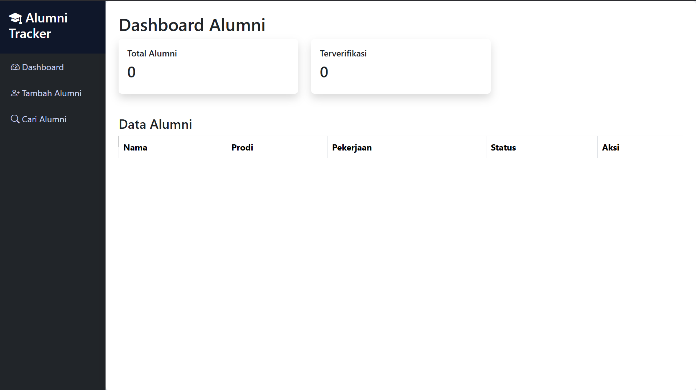
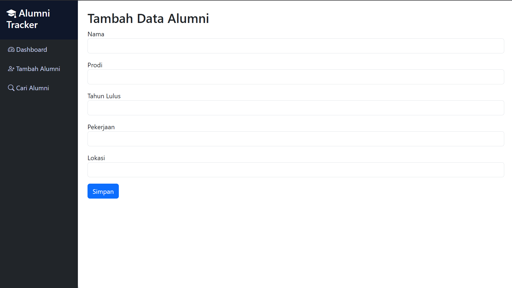
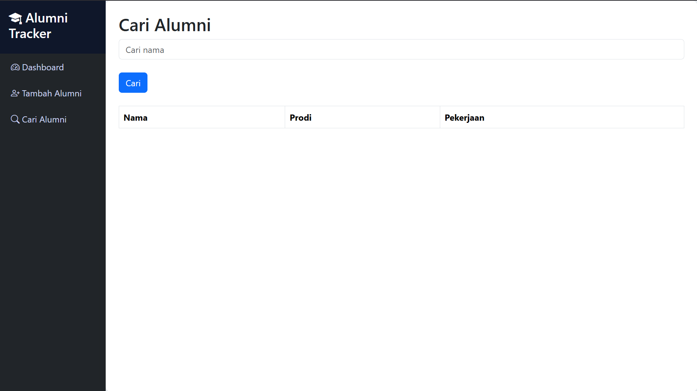
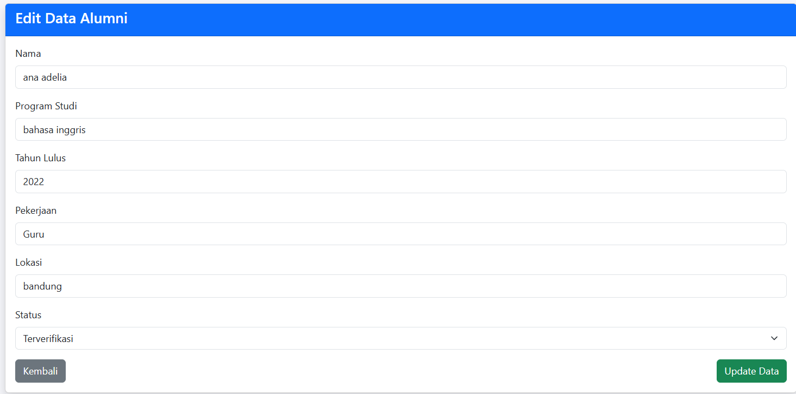

# Alumni Tracker System

## Deskripsi Sistem
Alumni Tracker adalah sistem berbasis web yang digunakan untuk mencatat dan melacak data alumni seperti nama, program studi, pekerjaan, lokasi kerja, dan status verifikasi alumni.

Sistem ini dibuat untuk membantu pengelolaan data alumni secara lebih terstruktur dan mudah diakses.

---

## Fitur Sistem
Fitur yang tersedia pada sistem ini:

1. Dashboard Alumni  
Menampilkan daftar seluruh data alumni yang tersimpan di database.

2. Tambah Data Alumni  
Admin dapat menambahkan data alumni baru ke dalam sistem.

3.  Edit Data Alumni
Admin dapat memperbarui informasi alumni jika terdapat kesalahan data.

4. Delete Data Alumni
Admin dapat menghapus data alumni yang tidak diperlukan dari database.

5. Cari Alumni  
Pengguna dapat mencari data alumni berdasarkan nama.

6. Verifikasi Alumni  
Admin dapat mengubah status alumni menjadi "Terverifikasi".

---

## Teknologi yang Digunakan
Sistem ini dibuat menggunakan teknologi berikut:

- PHP
- MySQL
- Bootstrap
- HTML
- CSS
- XAMPP

## Struktur Project

Struktur folder pada project ini:

```
alumni-tracker
│
├── assets
│   └── style.css
│
├── components
│   ├── header.php
│   └── sidebar.php
│
├── index.php
├── tambah.php
├── simpan.php
├── cari.php
├── verifikasi.php
├── database.php
```

## Cara Menjalankan Project

1. Install XAMPP
2. Jalankan Apache dan MySQL
3. Copy folder project ke: C:\xampp\htdocs
4. Buka browser dan akses: http://localhost/alumni-tracker

## Database

Buat database dengan nama: alumni_tracker


```

Lalu jalankan SQL berikut:
CREATE TABLE alumni(
    id INT AUTO_INCREMENT PRIMARY KEY,
    nama VARCHAR(100),
    prodi VARCHAR(100),
    tahun_lulus INT,
    pekerjaan VARCHAR(100),
    lokasi VARCHAR(100),
    status VARCHAR(30)
);
```


---

## Pengujian Sistem

| No | Fitur | Langkah Pengujian | Hasil |
|----|------|------------------|------|
| 1 | Tambah Alumni | Mengisi form tambah alumni | Berhasil |
| 2 | Cari Alumni | Mencari alumni berdasarkan nama | Berhasil |
| 3 | Verifikasi Alumni | Klik tombol verifikasi | Berhasil |
| 4 | Menampilkan Data | Data alumni muncul di dashboard | Berhasil |
| 5 | Edit Alumni | Mengubah data alumni | Berhasil |
| 6 | Delete Alumni | Menghapus data alumni | Berhasil |

---

## Tampilan Sistem

### Dasboard


### Tambah Alumni


### Cari Alumni


### Edit Alumni



## Author

Nama : Nurdiono Ilham Syawal Riyadi
NIM  : 202310370311164
Mata Kuliah : Rekayasa Kebutuhan C 
Project : Daily Project
